# wfspan: Wait-free Dynamic Memory Management — Implementation-Oriented Algorithm Guide

> Source: Xiangzhen Ouyang and Yian Zhu, **wfspan: Wait-free Dynamic Memory Management**, ACM Transactions on Embedded Computing Systems, Vol. 21, No. 4, Article 43, August 2022. DOI: `10.1145/3533724`.
>
> This document is **not a verbatim Markdown conversion of the paper**. It is an implementation-oriented guide for a coding agent, rewritten to make the allocator model, data structures, algorithms, progress arguments, invariants, and Rust implementation order easier to follow.

---

## 0. What this paper implements

wfspan is a **wait-free dynamic memory allocator** for multithreaded systems.

Most practical lock-free allocators have good average throughput, but a specific thread may repeatedly lose CAS or LL/SC races. That means the allocator can be lock-free while still allowing starvation for one unlucky or slow thread. In real-time embedded systems, that is a problem because the worst-case execution time becomes unbounded.

wfspan addresses this by combining:

```text
per-thread heaps
+ per-size-class span lists
+ span-local remote free-lists
+ non-linearizable wait-free MPSC free-lists
+ non-linearizable wait-free SPMC span-lists
+ a bounded helping protocol
```

The central tradeoff is:

```text
wfspan gets bounded execution steps
by giving up some internal linearizability
and accepting a larger, but still bounded, worst-case memory footprint.
```

This allocator does **not** try to make every internal queue or stack behave like a perfect linearizable data structure. Inside the allocator, it is acceptable if:

```text
some free blocks temporarily become invisible,
or one dequeue request effectively obtains two spans,
```

as long as:

```text
the extra memory is bounded,
the memory is not lost,
and the allocator can eventually reuse it.
```

For a coding agent, this distinction is crucial. If the implementation silently replaces the wfspan lists with ordinary lock-free CAS loops, it will no longer implement the paper’s wait-free design.

---

## 1. Terminology

| Term | Meaning |
|---|---|
| `N` | Number of participating threads, or the configured maximum thread count. |
| `C` | Number of size classes. |
| `S` | Span size. The paper’s evaluation uses 64 KiB. |
| `K` | Maximum number of private spans a thread heap may retain. |
| `H` | Helping budget. Maximum number of pending requests helped in one span-acquisition operation. |
| `P` | Number of other span-lists queried during span acquisition. The evaluation uses `P = N`. |
| span | Fixed-size contiguous memory region split into equal-size blocks. |
| block | Unit returned to the user by an allocation. |
| thread heap | Heap owned by one thread. |
| local span-list | Private span-list used only by the owning thread. |
| SPMC span-list | Public Single-Producer Multi-Consumer span-list. Other threads may acquire spans from it. |
| local free-list | Free-list used by the span owner for local allocation and local free. |
| remote free-list | MPSC free-list used when a non-owner thread frees a block in a span. |
| help record | Per-thread, per-size-class request record used by the SPMC helping protocol. |
| `q` | Local free block count in a span. |
| `g` | Globally visible free block count in a span. |
| `m` | Maximum number of blocks in a span. |
| `T` | Current owner thread of a span. |

---

## 2. Overall architecture

wfspan has no single global heap on the fast path. Instead, every thread owns a heap.

Each thread heap contains, for each size class:

```text
thread heap
  size class 0
    local span-list
    public SPMC span-list
  size class 1
    local span-list
    public SPMC span-list
  ...
```

The local span-list is private to the owning thread. It acts as a thread-local allocation buffer.

The public SPMC span-list is visible to other threads. When a thread cannot satisfy an allocation from its own heap, it can traverse public SPMC span-lists owned by other threads and acquire a span.

A span contains:

```text
span header
  size class
  block size
  maximum block count m
  owner thread T
  local free-list
  local free count q
  remote MPSC free-list
  globally visible free count g
  span-list node metadata

payload area
  block 0
  block 1
  block 2
  ...
```

The allocator’s synchronization strategy is split by ownership:

```text
owner thread allocation/free:
  use local free-list, mostly no synchronization

non-owner deallocation:
  push block into the span's remote MPSC free-list
  update global free count with FAA

span acquisition by other threads:
  use SPMC span-list + bounded helping
```

The per-thread private span count is bounded by `K`. If a thread owns too many spans, it publishes extra spans to its public SPMC span-list so other threads can acquire them.

---

## 3. Span model

A span is a fixed-size region aligned to its own size.

For example:

```text
SPAN_SIZE = 64 KiB
SPAN_ALIGN = 64 KiB
```

Then a span header can be found from any block pointer by masking low address bits:

```rust
fn span_base(ptr: *mut u8) -> *mut SpanHeader {
    let addr = ptr as usize;
    let base = addr & !(SPAN_SIZE - 1);
    base as *mut SpanHeader
}
```

A span is represented abstractly as:

```text
(T, m, q, g)
```

where:

```text
T = owner thread id, or null/none if ownerless
m = maximum number of blocks in this span
q = local free block count, visible only to the owner
g = globally visible free block count
```

Interpretation:

```text
q + g = number of free blocks known through the two accounting paths
```

The paper uses `q` so the owner can avoid atomic operations for local allocations/frees. The owner batches the effect of the local count into the global count when the local free-list becomes empty.

A Rust implementation should split local metadata and remote metadata into different cache lines.

```rust
#[repr(C, align(64))]
pub struct LocalMeta {
    pub local_free: LocalFreeList,
    pub local_free_count: usize,
    pub block_size: usize,
}

#[repr(C, align(64))]
pub struct RemoteMeta {
    pub remote_free: RemoteMpscFreeList,
    pub free_count: AtomicIsize,
}

#[repr(C, align(64))]
pub struct SpanHeader {
    pub owner: AtomicUsize,
    pub size_class: usize,
    pub block_count: usize,
    pub state: AtomicUsize,
    pub local: LocalMeta,
    pub remote: RemoteMeta,
}
```

Implementation note:

```text
The exact layout can differ, but preserve the separation between owner-local metadata and remote-free metadata.
```

---

## 4. Span state machine

The paper’s span states can be implemented approximately as:

```rust
#[repr(usize)]
pub enum SpanState {
    Raw = 0,
    FullLocal = 1,
    NonEmptyLocal = 2,
    FullPublic = 3,
    NonEmptyPublic = 4,
    Discarded = 5,
}
```

But do not treat this enum as the only source of truth. The real state is the combination of:

```text
owner T
maximum blocks m
local free count q
global free count g
membership in a local span-list
membership in an SPMC public span-list
```

State intuition:

```text
Raw:
  uninitialized span from the upper layer
  state = (0, 0, 0, 0)

FullLocal:
  owned by a thread
  all blocks are free
  q + g = m

NonEmptyLocal:
  owned by a thread
  some blocks are allocated, some are free
  0 < q + g < m

FullPublic:
  ownerless/public span in an SPMC span-list
  q + g = m

NonEmptyPublic:
  ownerless/public span in an SPMC span-list
  0 < q + g < m

Discarded:
  ownerless span with no currently reusable free block visible to owner
  reclaimed by the first remote deallocator that changes g from 0 to 1
```

Mermaid version:

```mermaid
stateDiagram-v2
    [*] --> Raw
    Raw --> FullLocal: span initialized for a size class
    FullLocal --> NonEmptyLocal: local allocation
    NonEmptyLocal --> FullLocal: local/remote free makes q + g = m
    NonEmptyLocal --> Discarded: owner commits q; q + g <= 0
    Discarded --> NonEmptyLocal: remote free changes g from 0 to 1 and claims ownership
    NonEmptyLocal --> NonEmptyPublic: owner publishes extra span
    FullLocal --> FullPublic: owner publishes extra full span
    NonEmptyPublic --> NonEmptyLocal: another thread acquires span
    FullPublic --> FullLocal: another thread acquires span
    FullLocal --> Raw: span released/deallocated to upper layer
```



Implementation advice:

```text
Use debug-only list-membership flags to catch invalid states.
A span must never be in a local span-list and a public SPMC span-list at the same time.
```

---

## 5. Atomic primitives used by wfspan

wfspan uses these primitives:

| Primitive | Purpose |
|---|---|
| `FAA(ptr, delta)` | Fetch-and-add. Used for free-count accounting. |
| `SWAP(ptr, value)` | Atomic exchange. Used in MPSC remote free-list push and reclaim. |
| `CAS(ptr, expected, desired)` | Single-word compare-and-swap. Used for help records and small state transitions. |
| `CAS2(ptr, expected, desired)` | Two-word CAS. Used on x86 to emulate strong LL/SC for pointer + version. |
| `LL/SC` | Load-linked/store-conditional. Used for one-shot SPMC pop on architectures that support it. |
| `ST_REL(ptr, value)` | Release store. Used to publish an enqueued span node. |

For Rust:

```text
FAA   -> AtomicUsize::fetch_add / AtomicIsize::fetch_add
SWAP  -> AtomicPtr::swap / AtomicUsize::swap
CAS   -> compare_exchange
ST_REL -> store(Ordering::Release)
```

For `CAS2`, do not fake it with two separate atomics. The pointer and version must be updated atomically as one logical value.

Suggested Rust abstraction:

```rust
#[repr(C, align(16))]
#[derive(Copy, Clone, Debug, Eq, PartialEq)]
pub struct HeadWord {
    pub ptr: usize,
    pub version: usize,
}

pub trait Cas2Backend {
    /// # Safety
    /// `head` must point to a 16-byte-aligned HeadWord that is valid for atomic access.
    unsafe fn load(head: *const HeadWord) -> HeadWord;

    /// # Safety
    /// `head` must point to a valid, 16-byte-aligned HeadWord.
    unsafe fn compare_exchange(
        head: *mut HeadWord,
        current: HeadWord,
        new: HeadWord,
    ) -> Result<HeadWord, HeadWord>;
}
```

Backend plan:

```text
x86_64:
  use CMPXCHG16B when available

aarch64:
  use LL/SC or one-word versioned pointer encoding

tests / loom:
  provide a deterministic model backend
```

---

## 6. MPSC wait-free remote free-list

### 6.1 Purpose

Each span has a remote free-list for blocks freed by non-owner threads.

This list is:

```text
Multi-Producer
Single-Consumer
wait-free
non-linearizable
```

Producers are remote deallocating threads.
The consumer is the span owner.

### 6.2 Why it is non-linearizable

The push operation has two steps:

```text
1. atomically swap the list head to the newly freed block
2. link the new block to the previous head
```

If a producer is preempted or halted after step 1 and before step 2, later nodes may become temporarily unreachable from the consumer’s point of view.

That would be invalid for a normal linearizable stack/list.

wfspan accepts this because:

```text
remote free-lists are per-span,
so the amount of temporarily unavailable memory is bounded by spans.
```

### 6.3 Data structure

```rust
pub const UNLINKED: *mut Block = usize::MAX as *mut Block;

#[repr(C)]
pub struct Block {
    pub next: AtomicPtr<Block>,
}

pub struct RemoteMpscFreeList {
    pub head: AtomicPtr<Block>,
}
```

### 6.4 Push algorithm

Remote deallocation uses `push`.

```rust
impl RemoteMpscFreeList {
    /// # Safety
    /// `block` must belong to the span that owns this remote list.
    /// It must not currently be in any other free-list.
    pub unsafe fn push(&self, block: *mut Block) {
        (*block).next.store(UNLINKED, Ordering::Relaxed);

        // This single SWAP is the producer's wait-free publication step.
        let old_head = self.head.swap(block, Ordering::AcqRel);

        // Complete the link after publication.
        (*block).next.store(old_head, Ordering::Release);
    }
}
```

Properties:

```text
bounded: yes, O(1)
loop-free: yes
linearizable: no
may temporarily hide nodes: yes
memory loss: no, if UNLINKED is handled correctly
```

### 6.5 Reclaim algorithm

The owner reclaims the whole remote list by swapping the head to null.

```rust
impl RemoteMpscFreeList {
    pub fn reclaim_all(&self) -> *mut Block {
        self.head.swap(core::ptr::null_mut(), Ordering::AcqRel)
    }
}
```

Properties:

```text
bounded: yes, O(1)
loop-free: yes
```

### 6.6 Consume reclaimed list

After `reclaim_all`, the owner still needs to append the reclaimed blocks into its local free-list.
This traversal must be bounded by `span.block_count`.

```rust
pub unsafe fn append_remote_to_local_bounded(
    span: *mut SpanHeader,
    mut head: *mut Block,
) -> usize {
    let mut appended = 0;
    let limit = (*span).block_count;

    for _ in 0..limit {
        if head.is_null() {
            break;
        }

        let next = (*head).next.load(Ordering::Acquire);

        if next == UNLINKED {
            // A producer has not completed the link yet.
            // Stop consuming this span for now; do not spin.
            break;
        }

        push_local_block(span, head);
        appended += 1;
        head = next;
    }

    appended
}
```

Important rule:

```text
UNLINKED is not allocator corruption.
It is an expected intermediate state.
Do not spin waiting for it to disappear.
```

---

## 7. SPMC wait-free span-list

### 7.1 Purpose

Each thread heap has public SPMC span-lists, one per size class.

```text
Single producer:
  the owner thread of the heap

Multiple consumers:
  other threads trying to acquire spans
```

The producer publishes spans when it owns more than `K` private spans or wants to make spans visible to others.

Consumers call `spanlists_acquire_span` to obtain a span from other heaps.

### 7.2 Enqueue

The producer is unique, so enqueue does not need a CAS.

```rust
pub struct SpanNode {
    pub next: AtomicPtr<SpanNode>,
    pub span: *mut SpanHeader,
}

pub struct SpmcSpanList {
    pub head: UnsafeCell<HeadWord>,       // pointer + version, changed by consumers
    pub tail: UnsafeCell<*mut SpanNode>,  // producer only
}
```

Enqueue pseudocode:

```rust
pub unsafe fn enqueue_by_owner(&self, node: *mut SpanNode) {
    let tail = *self.tail.get();

    (*node).next.store(core::ptr::null_mut(), Ordering::Relaxed);

    // Publish the node after all span metadata has been initialized.
    (*tail).next.store(node, Ordering::Release);

    *self.tail.get() = node;
}
```

Properties:

```text
producer only: yes
CAS needed: no
release store required: yes
```

### 7.3 One-shot pop

The consumer side is MS-queue-like, but the paper’s wait-free design depends on one critical rule:

```text
try_pop_head_once performs at most one lock-free pop attempt.
It must not retry until success.
```

Suggested API:

```rust
pub enum TryPop {
    Span(*mut SpanHeader),
    Empty,
    Failed,
}
```

Rust-like pseudocode:

```rust
pub unsafe fn try_pop_head_once<B: Cas2Backend>(&self) -> TryPop {
    let old = B::load(self.head.get());
    let head_node = old.ptr as *mut SpanNode;

    if head_node.is_null() {
        return TryPop::Empty;
    }

    let next = (*head_node).next.load(Ordering::Acquire);

    if next.is_null() {
        return TryPop::Empty;
    }

    let new = HeadWord {
        ptr: next as usize,
        version: old.version.wrapping_add(1),
    };

    match B::compare_exchange(self.head.get(), old, new) {
        Ok(_) => {
            let span = (*next).span;
            TryPop::Span(span)
        }
        Err(_) => TryPop::Failed,
    }
}
```

This is deliberately **not**:

```rust
loop {
    // retry CAS until success
}
```

If the single attempt fails, another thread made progress. The current thread then uses the helping protocol to guarantee starvation freedom.

### 7.4 ABA protection

The SPMC pop changes a queue head. Without ABA protection:

```text
Thread A reads head = X.
Thread B removes X and later makes X appear as head again.
Thread A's CAS succeeds incorrectly.
```

wfspan avoids this through:

```text
LL/SC, or
pointer + version updated by CAS2.
```

Rust implementation rule:

```text
Do not store head pointer and version in two independent atomics.
The pair must be atomically compared and exchanged.
```

---

## 8. Helping protocol

### 8.1 Why helping is needed

A one-shot pop can fail.

If a thread simply tries again in a loop, the algorithm becomes lock-free, not wait-free.

wfspan avoids starvation by having threads publish requests in help records. Other threads are required to help a bounded number of pending requests before finishing their own span acquisition.

The core idea:

```text
1. Publish my request.
2. Help at most H pending requests from other threads.
3. Try to finish my own request.
4. Either I finish it, or another thread finishes it for me.
```

### 8.2 HelpRecord

The paper encodes a pending flag in the low bit of a word. Use a single `AtomicUsize` to represent either:

```text
empty / null
pending request with phase
completed request containing a span pointer
```

Suggested encoding:

```rust
#[derive(Copy, Clone, Debug, Eq, PartialEq)]
pub struct EncodedReq(pub usize);

impl EncodedReq {
    pub fn empty() -> Self {
        Self(0)
    }

    pub fn pending(phase: usize) -> Self {
        Self((phase << 1) | 1)
    }

    pub fn done_with_span(span: *mut SpanHeader) -> Self {
        debug_assert_eq!((span as usize) & 1, 0);
        Self(span as usize)
    }

    pub fn is_empty(self) -> bool {
        self.0 == 0
    }

    pub fn is_pending(self) -> bool {
        (self.0 & 1) == 1
    }

    pub fn phase(self) -> usize {
        self.0 >> 1
    }

    pub fn span(self) -> *mut SpanHeader {
        (self.0 & !1) as *mut SpanHeader
    }
}

pub struct HelpRecord {
    pub phase_pending_or_span: AtomicUsize,
    pub last_phase: AtomicUsize,
}
```

Per-thread, per-size-class table:

```rust
pub struct HelpTable<const N: usize, const C: usize> {
    pub records: [[HelpRecord; C]; N],
}
```

For Rust allocator core:

```text
Do not allocate HelpRecord dynamically.
Do not use Vec.
Use fixed arrays or MaybeUninit-based initialization.
```

### 8.3 reclaim_request

Before publishing a new request, a thread first checks if a previous request already contains a completed span.

```rust
pub fn reclaim_request(req: &HelpRecord) -> *mut SpanHeader {
    let old = req
        .phase_pending_or_span
        .swap(EncodedReq::empty().0, Ordering::AcqRel);

    let enc = EncodedReq(old);

    if enc.is_empty() || enc.is_pending() {
        core::ptr::null_mut()
    } else {
        enc.span()
    }
}
```

Why this matters:

```text
Because the SPMC list is non-linearizable,
one request may result in two acquired spans.
One may be returned directly,
and the other may remain in the request record.
That span must be reclaimed on a later allocation.
```

### 8.4 help_finishing_req

This function tries to complete a pending request using a span popped from a public SPMC span-list.

Important implementation constraint:

```text
Each call must be bounded.
Do not translate the paper's while-loop into an unbounded Rust while-loop.
```

Rust-like one-shot version:

```rust
pub unsafe fn help_finishing_req<B: Cas2Backend>(
    list: &SpmcSpanList,
    req: &HelpRecord,
    held_span: &mut *mut SpanHeader,
    list_is_null: &mut bool,
) {
    let start = EncodedReq(
        req.phase_pending_or_span.load(Ordering::Acquire),
    );

    if !start.is_pending() {
        return;
    }

    let phase = start.phase();

    // Re-read to avoid helping a different phase.
    let current = EncodedReq(
        req.phase_pending_or_span.load(Ordering::Acquire),
    );

    if !current.is_pending() || current.phase() != phase {
        return;
    }

    if (*held_span).is_null() {
        match list.try_pop_head_once::<B>() {
            TryPop::Span(span) => {
                *held_span = span;
            }
            TryPop::Empty => {
                *list_is_null = true;
                return;
            }
            TryPop::Failed => {
                return;
            }
        }
    }

    let expected = EncodedReq::pending(phase).0;
    let desired = EncodedReq::done_with_span(*held_span).0;

    if req
        .phase_pending_or_span
        .compare_exchange(
            expected,
            desired,
            Ordering::AcqRel,
            Ordering::Acquire,
        )
        .is_ok()
    {
        // The span has been transferred into the request record.
        *held_span = core::ptr::null_mut();
    }
}
```

Possible outcomes:

```text
request was already completed -> return
span-list empty -> set list_is_null
pop failed -> return; some other thread made progress
CAS into help record succeeded -> request completed
CAS failed -> phase changed or someone else completed it
```

---

## 9. spanlists_acquire_span

### 9.1 Purpose

`spanlists_acquire_span` tries to acquire a span of a size class from public SPMC span-lists.

This is the only substantial loop in allocation. Its boundedness is what gives allocation wait-freedom.

Inputs:

```text
current thread heap
requested size class
current thread id
```

Output:

```text
span pointer, or null if no span is acquired within the configured query bound
```

### 9.2 Implementation flow for the paper's Algorithms 3 and 4

The implementation-level flow:

```text
1. Load current query position and helping position.
2. Check my HelpRecord for a previously completed span.
3. If present, reclaim and return it.
4. Publish a new pending request with a new phase.
5. Help at most H pending requests.
6. Traverse at most P public span-lists.
7. Try to finish my own request.
8. If a span is acquired, return it.
9. Otherwise, try to clear my pending request and return null.
10. Save updated query/helping positions for the next call.
```

### 9.3 Rust-like pseudocode

```rust
pub unsafe fn spanlists_acquire_span<
    B: Cas2Backend,
    const N: usize,
    const C: usize,
>(
    alloc: &WfSpanAllocator<N, C>,
    tid: usize,
    size_class: usize,
    step: &mut StepCounter,
) -> *mut SpanHeader {
    let heap = &alloc.heaps[tid];

    let mut query_pos = heap.cur_query[size_class].load(Ordering::Relaxed) % N;
    let mut helping_pos = heap.helping_pos[size_class].load(Ordering::Relaxed) % N;

    let my_req = &alloc.help.records[tid][size_class];

    // 1. Reclaim span already completed for this thread.
    let reclaimed = reclaim_request(my_req);
    if !reclaimed.is_null() {
        return reclaimed;
    }

    // 2. Publish new request.
    let phase = my_req.last_phase.fetch_add(1, Ordering::Relaxed).wrapping_add(1);
    let published = EncodedReq::pending(phase);
    my_req
        .phase_pending_or_span
        .store(published.0, Ordering::Release);

    let mut held_span: *mut SpanHeader = core::ptr::null_mut();
    let mut list_is_null = false;

    // 3. Help a bounded number of other requests.
    let mut help_count = 0;
    let mut help_query = 0;

    while help_count < HELP_BUDGET_H && help_query < QUERY_LIMIT_P {
        step.help_steps += 1;

        let help_tid = helping_pos % N;
        let req = &alloc.help.records[help_tid][size_class];
        let target_heap = &alloc.heaps[query_pos % N];
        let target_list = &target_heap.public_spans[size_class];

        let req_state = EncodedReq(
            req.phase_pending_or_span.load(Ordering::Acquire),
        );

        if req_state.is_pending() {
            help_finishing_req::<B>(
                target_list,
                req,
                &mut held_span,
                &mut list_is_null,
            );

            if list_is_null {
                help_query += 1;
                query_pos = (query_pos + 1) % N;
                list_is_null = false;
                continue;
            }
        }

        help_count += 1;
        helping_pos = (helping_pos + 1) % N;
    }

    // 4. Try to finish my own request while traversing at most P lists.
    while help_query < QUERY_LIMIT_P {
        step.query_steps += 1;

        let state = EncodedReq(
            my_req.phase_pending_or_span.load(Ordering::Acquire),
        );

        if !state.is_pending() {
            // Someone has completed my request.
            let span = reclaim_request(my_req);
            heap.cur_query[size_class].store(query_pos, Ordering::Relaxed);
            heap.helping_pos[size_class].store(helping_pos, Ordering::Relaxed);
            return span;
        }

        let target_heap = &alloc.heaps[query_pos % N];
        let target_list = &target_heap.public_spans[size_class];

        help_finishing_req::<B>(
            target_list,
            my_req,
            &mut held_span,
            &mut list_is_null,
        );

        if list_is_null {
            help_query += 1;
            query_pos = (query_pos + 1) % N;
            list_is_null = false;
            continue;
        }

        let span = reclaim_request(my_req);
        if !span.is_null() {
            heap.cur_query[size_class].store(query_pos, Ordering::Relaxed);
            heap.helping_pos[size_class].store(helping_pos, Ordering::Relaxed);
            return span;
        }

        // If we temporarily popped a span but failed to place it in the request,
        // return it directly. This is the non-linearizable case.
        if !held_span.is_null() {
            let span = held_span;
            held_span = core::ptr::null_mut();
            heap.cur_query[size_class].store(query_pos, Ordering::Relaxed);
            heap.helping_pos[size_class].store(helping_pos, Ordering::Relaxed);
            return span;
        }

        // No progress from this list; move on within the bounded query budget.
        help_query += 1;
        query_pos = (query_pos + 1) % N;
    }

    // 5. Failed to acquire within P queried lists. Clear the pending request if it is still pending.
    let expected = EncodedReq::pending(phase).0;
    let _ = my_req.phase_pending_or_span.compare_exchange(
        expected,
        EncodedReq::empty().0,
        Ordering::AcqRel,
        Ordering::Acquire,
    );

    // If someone completed the request concurrently, reclaim it.
    let span = reclaim_request(my_req);

    heap.cur_query[size_class].store(query_pos, Ordering::Relaxed);
    heap.helping_pos[size_class].store(helping_pos, Ordering::Relaxed);

    span
}
```

Notes for a coding agent:

```text
The exact Rust code may differ.
The important properties are bounded H/P loops, one-shot pop, and recoverable help-record spans.
```

---

## 10. Why non-linearizable SPMC span-list is acceptable

A normal queue should not let one dequeue request remove two nodes.

wfspan can temporarily behave that way:

```text
Thread A publishes a request.
Thread B completes A's request and stores span X in A's HelpRecord.
Thread A does not notice yet.
Thread A also succeeds in popping span Y directly.
Thread A returns Y now.
Span X remains in A's HelpRecord and is reclaimed on A's next span acquisition.
```

This is non-linearizable as a queue, but acceptable as an allocator-internal span source because:

```text
span X is not lost;
span X is associated with A's request record;
span X is reclaimed later;
at most one such extra span exists per thread per size class;
therefore the extra memory is bounded.
```

Implementation rule:

```text
Never drop or overwrite a completed HelpRecord span.
Always check reclaim_request before publishing a new request.
```

---

## 11. Allocation algorithm

### 11.1 High-level flow

Allocation does this:

```text
1. Convert Layout to size class.
2. Try the current thread's local non-empty span.
3. Pop one block from the local free-list.
4. If local free-list is empty, commit local free count q into global count g using FAA.
5. If remote free-list has blocks, reclaim it with SWAP.
6. If the span has no reusable block, discard it.
7. If no local span is available, acquire a span from public SPMC span-lists.
8. If no suitable span is found, acquire a full/raw span if available.
9. If all attempts fail, return null.
```

### 11.2 Rust-like pseudocode

```rust
pub unsafe fn alloc_with_token<const N: usize, const C: usize>(
    alloc: &WfSpanAllocator<N, C>,
    layout: Layout,
    token: ThreadToken,
) -> *mut u8 {
    let Some(size_class) = size_to_class(layout.size(), layout.align()) else {
        return core::ptr::null_mut();
    };

    let heap = &alloc.heaps[token.id];
    let mut step = StepCounter::new();

    // 1. Try local span-list first.
    if let Some(span) = heap.local_spans[size_class].front_non_empty() {
        let ptr = alloc_from_local_span(span, &mut step);
        if !ptr.is_null() {
            return ptr;
        }
    }

    // 2. Reclaim remote free blocks from local spans if needed.
    if let Some(span) = heap.local_spans[size_class].find_reclaimable_bounded() {
        reclaim_remote_into_local(span, &mut step);
        let ptr = alloc_from_local_span(span, &mut step);
        if !ptr.is_null() {
            return ptr;
        }
    }

    // 3. Acquire a non-empty span from other threads.
    let span = spanlists_acquire_span::<DefaultCas2Backend, N, C>(
        alloc,
        token.id,
        size_class,
        &mut step,
    );

    if !span.is_null() {
        claim_span_for_thread(span, token.id, size_class);
        heap.local_spans[size_class].push_front(span);

        let ptr = alloc_from_local_span(span, &mut step);
        if !ptr.is_null() {
            return ptr;
        }
    }

    // 4. Try to acquire or initialize a raw/full span.
    let raw = alloc.fixed_span_pool.acquire_raw_span(size_class, token.id, &mut step);
    if !raw.is_null() {
        init_span(raw, size_class, class_to_size(size_class), token.id);
        heap.local_spans[size_class].push_front(raw);
        return alloc_from_local_span(raw, &mut step);
    }

    // 5. Fixed-heap prototype: exhaustion returns null.
    core::ptr::null_mut()
}
```

### 11.3 Local span allocation

```rust
pub unsafe fn alloc_from_local_span(
    span: *mut SpanHeader,
    step: &mut StepCounter,
) -> *mut u8 {
    step.local_steps += 1;

    let block = (*span).local.local_free.pop();
    if block.is_null() {
        return core::ptr::null_mut();
    }

    (*span).local.local_free_count -= 1;
    block_payload(block)
}
```

This local path should avoid synchronization where possible.

---

## 12. Deallocation algorithm

### 12.1 High-level flow

Deallocation does this:

```text
1. Compute the span header from the pointer.
2. Check span owner.
3. If current thread is owner: push to local free-list and increment q.
4. Otherwise: push to remote MPSC free-list and increment g via FAA.
5. If remote FAA changes g from 0 to 1, claim/reclaim a discarded span.
```

### 12.2 span_from_ptr

```rust
pub unsafe fn span_from_ptr(ptr: *mut u8) -> *mut SpanHeader {
    let addr = ptr as usize;
    let base = addr & !(SPAN_SIZE - 1);
    base as *mut SpanHeader
}
```

This depends on:

```text
SPAN_SIZE is a power of two.
Every span is SPAN_SIZE-aligned.
Every allocation pointer belongs to exactly one span managed by this allocator.
```

### 12.3 dealloc_with_token

```rust
pub unsafe fn dealloc_with_token<const N: usize, const C: usize>(
    alloc: &WfSpanAllocator<N, C>,
    ptr: *mut u8,
    layout: Layout,
    token: ThreadToken,
) {
    if ptr.is_null() {
        return;
    }

    let span = span_from_ptr(ptr);
    let owner = (*span).owner.load(Ordering::Acquire);

    if owner == token.id {
        dealloc_local(span, ptr, token);
    } else {
        dealloc_remote(span, ptr, token);
    }
}
```

### 12.4 Local deallocation

```rust
pub unsafe fn dealloc_local(
    span: *mut SpanHeader,
    ptr: *mut u8,
    _token: ThreadToken,
) {
    let block = block_from_payload(ptr);
    push_local_block(span, block);
    (*span).local.local_free_count += 1;

    if (*span).local.local_free_count + global_count(span) as usize == (*span).block_count {
        maybe_mark_span_full(span);
    }
}
```

### 12.5 Remote deallocation

```rust
pub unsafe fn dealloc_remote(
    span: *mut SpanHeader,
    ptr: *mut u8,
    token: ThreadToken,
) {
    let block = block_from_payload(ptr);

    (*span).remote.remote_free.push(block);

    let old = (*span)
        .remote
        .free_count
        .fetch_add(1, Ordering::AcqRel);

    if old == 0 {
        // The span was discarded and ownerless.
        // This deallocating thread becomes the owner and reclaims the span.
        try_claim_discarded_span(span, token.id);
    }
}
```

Properties:

```text
local free: bounded, no loop
remote free: bounded, MPSC push + FAA
remote deallocation requires at most a few atomic operations
```

---

## 13. Span reclamation details

When the owner’s local free-list becomes empty, it commits local accounting into the global free count.

Conceptually:

```text
old_g = FAA(span.free_count, q)
new_g = old_g + q
```

If `new_g <= 0`, the owner discards the span.

```text
span owner = null
state = Discarded
```

If `new_g > 0`, there are remotely freed blocks. The owner reclaims the remote free-list:

```rust
let remote = span.remote.remote_free.reclaim_all();
append_remote_to_local_bounded(span, remote);
```

Subtle case:

```text
A remote deallocator may push a block into the MPSC list
but not yet increment free_count.
```

Therefore the actual number of blocks in the remote list may be larger than the global free count. If the owner observes a non-positive count and discards the span, a later remote deallocator that increments the count from `0` to `1` reclaims the span.

Implementation rule:

```text
The free count is an accounting protocol, not a complete traversal of reality.
The reclaim/discard path must tolerate temporarily inconsistent-looking states caused by remote push ordering.
```

---

## 14. Wait-freedom summary

This section converts the paper’s proof outline into implementation constraints.

### Lemma 1: try_pop_head_once

```text
try_pop_head_once is O(1) bounded wait-free.
```

Reason:

```text
It performs at most one MS-queue-like pop attempt.
No retry loop is allowed.
```

### Lemma 2: published helping request

A published helping request completes within a bounded number of steps.

Paper-style bound:

```text
O(((N - 1) / H) * (N - 1) + 1)
```

Reason:

```text
Other threads help a finite number of pending requests.
A request that cannot be completed by its owner will be completed by helpers.
```

### Theorem: spanlists_acquire_span

```text
spanlists_acquire_span is O(N^2) bounded wait-free.
```

Implementation-level bound:

```text
help loops are bounded by H
query loops are bounded by P
one-shot pop is O(1)
published request completion is bounded
```

The paper also discusses an alternative wfqueue-style helping protocol that can reduce the bound to `O(N)` at the cost of extra global synchronization overhead.

### Deallocation

```text
deallocation has no unbounded loops.
remote free is MPSC push + FAA.
therefore deallocation is O(1) bounded wait-free.
```

### Allocation

```text
allocation is bounded by spanlists_acquire_span.
therefore allocation is O(N^2) bounded wait-free in the main design.
```

Architecture caution:

```text
On x86_64, versioned CAS2 can emulate strong LL/SC.
On aarch64, weak LL/SC can be interrupted indefinitely unless additional assumptions or workaround encoding is used.
Document the backend assumptions clearly.
```

---

## 15. Memory footprint bound

wfspan intentionally increases bounded worst-case memory footprint.

Sources of extra memory:

```text
1. spans held in HelpRecords
2. extra spans caused by span-list query failures
3. spans temporarily blocked by MPSC remote free-list non-linearizability
```

Let:

```text
N = number of threads
C = number of size classes
S = span size
P = number of span-lists queried
```

### 15.1 Spans left in HelpRecords

A request may obtain two spans:

```text
one returned directly to the requester
one left in the requester's HelpRecord
```

At worst:

```text
N * C * S
```

### 15.2 Span-list query failure

If a thread only queries `P` span-lists and the available spans are elsewhere, it may request/acquire extra memory from the upper layer.

Bound:

```text
(ceil(N / P) - 1) * (N - 1) * C * S
```

When:

```text
P = N
```

this term becomes zero.

### 15.3 MPSC remote free-list blocking

If remote deallocators halt after SWAP and before linking, spans can become temporarily unavailable.

Bound:

```text
N * (N - 1) * C * S
```

### 15.4 Total additional footprint

The paper summarizes the additional memory footprint approximately as:

```text
A(N) = (N + (ceil(N / P) + N - 1) * (N - 1)) * C * S
```

This is:

```text
O(N^2)
```

Implementation requirements:

```text
Expose footprint statistics.
Track spans retained in HelpRecords.
Track spans delayed by remote free-list blocking.
Allow P to be configured.
Benchmark with P = N, P = N/2, P = N/4.
```

---

## 16. Rust invariants

### 16.1 Block invariants

```text
A block is either allocated or free, never both.
A free block appears in at most one free-list.
An allocated block appears in no free-list.
A block belongs to exactly one span.
block_from_payload(block_payload(block)) == block.
```

### 16.2 Span invariants

```text
Every span belongs to exactly one size class after initialization.
A span block size never changes after initialization.
A span is either local, public, raw, or discarded.
A span must not be in both local and public span-lists.
An owner-owned span has owner = valid thread id.
A discarded span has no owner.
q + g must stay within a documented accounting range.
```

### 16.3 HelpRecord invariants

```text
Empty record contains 0.
Pending record has low bit = 1.
Completed record contains an aligned span pointer with low bit = 0.
Completed record must not be overwritten without reclaiming its span.
Phase numbers monotonically increase modulo word size.
Helping the same record twice must be safe.
```

### 16.4 SPMC invariants

```text
Only the owner thread enqueues.
Consumers may pop.
try_pop_head_once performs at most one CAS2/LLSC attempt.
The head pointer and version are atomically updated together.
A span popped by a failed request is either returned or stored in a HelpRecord.
```

### 16.5 MPSC invariants

```text
Remote push performs SWAP then link.
UNLINKED is a valid temporary next pointer.
Consumer stops when it sees UNLINKED.
Consumer does not spin waiting for UNLINKED to resolve.
Remote free-list blocking is bounded at span granularity.
```

---

## 17. Coding-agent implementation order

The allocator should be implemented in this order.

```text
1. sequential span allocator
2. size classes
3. MPSC remote free-list
4. CAS2 / tagged head backend
5. SPMC span-list
6. HelpRecord / helping protocol
7. full alloc/dealloc
8. stats / verification
9. optional GlobalAlloc
```

Do not start with `GlobalAlloc`. That hides important problems.

### Milestone 1: sequential span allocator

Files:

```text
span.rs
block.rs
local_list.rs
heap.rs
```

Deliver:

```text
SpanHeader
Block
LocalFreeList
init_span
span_from_ptr
alloc_from_local_span
dealloc_to_local_span
sequential tests
```

### Milestone 2: size classes

Files:

```text
size_class.rs
align.rs
```

Deliver:

```text
size_to_class
class_to_size
alignment handling
large allocation dispatch to the LargeRun allocator
```

### Milestone 3: MPSC remote free-list

Files:

```text
remote_mpsc.rs
```

Deliver:

```text
RemoteMpscFreeList::push
RemoteMpscFreeList::reclaim_all
UNLINKED sentinel
bounded append to local free-list
producer-stopped-after-SWAP tests
```

### Milestone 4: CAS2 / tagged head backend

Files:

```text
atomic_backend.rs
tagged.rs
```

Deliver:

```text
HeadWord { ptr, version }
Cas2Backend trait
x86_64 cmpxchg16b backend or cfg-gated AtomicU128 backend
loom/test backend
ABA tests
```

### Milestone 5: SPMC span-list

Files:

```text
spmc_span_list.rs
```

Deliver:

```text
owner-only enqueue
try_pop_head_once
TryPop::Span / Empty / Failed
no retry loop
versioned head tests
```

### Milestone 6: HelpRecord / helping protocol

Files:

```text
help_record.rs
acquire.rs
```

Deliver:

```text
EncodedReq
HelpRecord
HelpTable
reclaim_request
help_finishing_req
spanlists_acquire_span
bounded H/P loops
tests for helped request completion
```

### Milestone 7: full allocator

Files:

```text
allocator.rs
thread.rs
heap.rs
pagemap.rs
```

Deliver:

```text
ThreadToken
ThreadRegistry
alloc_with_token
dealloc_with_token
local free path
remote free path
span discard/reclaim
K-limited local span retention
public span publishing
```

### Milestone 8: stats / verification

Files:

```text
stats.rs
docs/invariants.md
docs/progress.md
docs/unsafe-audit.md
```

Deliver:

```text
StepCounter
AllocatorStats
debug invariant checker
memory footprint bound calculator
unsafe audit comments
```

### Milestone 9: optional GlobalAlloc

Files:

```text
global.rs
```

Deliver only after the core allocator is stable:

```text
unsafe impl GlobalAlloc
thread-local token wrapper under std feature
null on unsupported/exhausted allocation
no recursive allocation
```

---

## 18. Things the coding agent must not do

Forbidden:

```text
unbounded loop { compare_exchange ... }
unbounded while CAS fails { retry }
ordinary Treiber stack as a substitute for SPMC span-list + helping
std::sync::Mutex in allocator core
std::sync::RwLock in allocator core
parking_lot in allocator core
Vec in allocator core
Box in allocator core
String in allocator core
format! in allocator core
println! in allocator core
OS allocation in the wait-free path
dropping a completed HelpRecord span
treating UNLINKED as corruption
updating pointer and version as two separate atomics
unsafe blocks without Safety comments
```

Allowed bounded loops:

```text
for i in 0..N
for i in 0..C
for i in 0..P
for i in 0..H
for i in 0..blocks_per_span
```

---

## 19. StepCounter

Every public allocator operation should record bounded steps in debug/stats builds.

```rust
#[derive(Default, Clone, Copy)]
pub struct StepCounter {
    pub local_steps: usize,
    pub remote_steps: usize,
    pub cas_attempts: usize,
    pub cas2_attempts: usize,
    pub swap_ops: usize,
    pub faa_ops: usize,
    pub help_steps: usize,
    pub query_steps: usize,
    pub blocks_scanned: usize,
}
```

Debug assertions:

```rust
impl StepCounter {
    pub fn assert_bounds<const N: usize, const C: usize>(&self, blocks_per_span: usize) {
        assert!(self.help_steps <= HELP_BUDGET_H * N + N);
        assert!(self.query_steps <= QUERY_LIMIT_P + N);
        assert!(self.blocks_scanned <= blocks_per_span * 2 + 1);
    }
}
```

Do not treat this as a formal proof. It is an implementation guardrail that catches accidental unbounded retry loops.

---

## 20. Test plan

### 20.1 Sequential tests

```text
initialize one span
allocate every block
next allocation returns null
free one block and allocate again
free all blocks and allocate again
span_from_ptr works
all size classes work
alignment handling works
large allocation uses the LargeRun path; only requests above MAX_LARGE_SPANS return null/error
```

### 20.2 Remote free-list tests

```text
remote push one block
remote push many blocks
reclaim_all returns the published list
producer stops after SWAP before linking next
consumer sees UNLINKED and stops
no block is lost after producer resumes
```

### 20.3 SPMC span-list tests

```text
owner enqueue
single consumer pop
multiple consumers pop
empty list returns Empty
CAS2 failure returns Failed
no retry loop is executed
version increments on successful pop
```

### 20.4 Helping tests

```text
thread A publishes request
thread B completes A's request
thread A reclaims completed span
request already completed before owner resumes
one request obtains two spans
extra span remains in HelpRecord
extra span is reclaimed later
```

### 20.5 Concurrent smoke tests

```text
N threads allocate/free locally
producer allocates and consumer frees
remote-free-heavy workload
mixed-size workload
forced exhaustion
forced MPSC SWAP-before-link pause
forced SPMC pop-before-help-record-CAS pause
```

### 20.6 Loom model

Use tiny configurations:

```text
N = 2
C = 1
spans = 2
blocks_per_span = 2
K = 1
H = 1
P = 2
```

Model-check invariants:

```text
same block is never allocated twice
allocated block never appears in free-list
free block is not lost
HelpRecord span is reclaimable
span is not in local and public list at the same time
```

---

## 21. Common implementation mistakes

### Mistake 1: turning the algorithm into an ordinary CAS loop

Bad:

```rust
loop {
    let old = head.load(Ordering::Acquire);
    let new = compute(old);
    if head.compare_exchange(old, new, Ordering::AcqRel, Ordering::Acquire).is_ok() {
        return item;
    }
}
```

This is lock-free, not wait-free.

Good:

```rust
match try_pop_head_once() {
    TryPop::Span(span) => span,
    TryPop::Empty => next_list_or_null(),
    TryPop::Failed => {
        publish_request();
        help_bounded();
        finish_own_request_bounded()
    }
}
```

### Mistake 2: dropping a completed HelpRecord span

Bad:

```rust
my_req.phase_pending_or_span.store(new_pending, Ordering::Release);
```

without checking whether the old value was a completed span.

Good:

```rust
let span = reclaim_request(my_req);
if !span.is_null() {
    return span;
}
publish_new_pending_request(my_req);
```

### Mistake 3: treating UNLINKED as corruption

`UNLINKED` is an expected state in MPSC push.

The consumer must stop and delay span reuse. It must not panic or spin.

### Mistake 4: updating pointer and version separately

Bad:

```rust
head_ptr.compare_exchange(...);
head_version.fetch_add(1, ...);
```

Good:

```rust
cas2(&HeadWord { ptr, version }, new_head_word);
```

---

## 22. Prompt for a coding agent

```text
Implement a Rust prototype of wfspan-style wait-free dynamic memory management.

This is not a normal lock-free allocator. Preserve the paper's design:
- per-thread heaps,
- per-size-class local span-lists,
- public SPMC wait-free span-lists,
- span-local MPSC wait-free remote free-lists,
- non-linearizable but bounded internal data structures,
- bounded helping protocol,
- allocation bounded by spanlists_acquire_span,
- deallocation O(1) bounded.

Hard constraints:
- no unbounded CAS retry loops,
- no Mutex/RwLock in allocator core,
- no Vec/Box/String/format!/println! in allocator core,
- no OS allocation on the wait-free path,
- every loop must have a static bound: N, C, P, H, or blocks_per_span,
- every public operation must update StepCounter in stats/debug mode,
- every unsafe block must have a Safety comment,
- never drop a completed HelpRecord span,
- never treat UNLINKED as corruption,
- never update pointer and version as separate atomics.

Implement in this order:
1. sequential span allocator,
2. size classes,
3. MPSC remote free-list,
4. CAS2/tagged head backend,
5. SPMC span-list with one-shot pop,
6. HelpRecord and helping protocol,
7. full alloc/dealloc with ThreadToken,
8. stats and invariant checker,
9. optional GlobalAlloc wrapper,
10. tests, loom model, Miri, and benchmarks.
```

---

## 23. Minimal skeleton

```text
src/
  lib.rs
  config.rs
  align.rs
  atomic_backend.rs
  tagged.rs
  heap.rs
  thread.rs
  size_class.rs
  pagemap.rs
  span.rs
  block.rs
  local_list.rs
  remote_mpsc.rs
  spmc_span_list.rs
  help_record.rs
  acquire.rs
  allocator.rs
  global.rs
  stats.rs

tests/
  sequential.rs
  remote_free.rs
  spmc_basic.rs
  helping_small.rs
  concurrent_smoke.rs
  exhaustion.rs

benches/
  alloc_free.rs
  remote_free.rs
  wcet_like.rs

docs/
  wfspan-model.md
  invariants.md
  progress.md
  memory-footprint.md
  unsafe-audit.md
```

Feature flags:

```toml
[features]
default = ["std"]
std = []
no_std = []
global = []
stats = []
loom = []
nightly = []
```

---

## 24. Definition of implementation success

The prototype is successful when:

```text
sequential allocation/free works
remote free-list handles blocked producers
SPMC span-list has no unbounded retry loop
helping protocol completes pending requests
one-request-two-spans case is safe and recoverable
allocation/deallocation tests pass under concurrency
StepCounter remains within configured bounds
invariant checker finds no duplicate/lost blocks
Miri passes sequential unsafe tests
Loom passes tiny concurrent models
benchmarks report latency and footprint, not just throughput
```

Production readiness would require more work:

```text
formal progress review
architecture-specific atomic validation
robust GlobalAlloc integration
large allocation support through LargeRun classes
OS page backend
realloc
hardening against misuse
extensive stress testing
```

---

## 25. Mental model for implementation

Think of wfspan as two layers.

Layer 1: local allocator mechanics

```text
span
block
local free-list
remote free-list
size class
thread heap
```

Layer 2: wait-free span transfer

```text
SPMC public span-list
one-shot pop
HelpRecord
bounded helping
non-linearizable recovery
```

The hard part is not `alloc()` itself.

The hard part is preserving this property:

```text
When a CAS/LLSC attempt fails,
the thread must not retry forever.
It must publish/help/finish within bounded steps.
```

That is the difference between:

```text
an ordinary lock-free allocator
```

and:

```text
wfspan.
```

---

# Appendix A: Large Allocation Extension

This appendix modifies the prototype roadmap so that wfspan-style allocation can support objects larger than a single span while preserving a bounded-step design.

The original small-object path manages one fixed-size span at a time. A span is split into same-size blocks and uses a local free-list plus a per-span MPSC remote free-list. This is a good fit for small objects, but it is awkward for objects larger than one span because one allocation must reserve multiple contiguous spans and must be freed as one unit.

The large-object extension therefore introduces a second path:

```text
small allocation:
  size < LARGE_THRESHOLD
  allocate one block from a small-object span

large allocation:
  size >= LARGE_THRESHOLD
  allocate a contiguous run of one or more spans
```

The large path does not split a run into small blocks. The whole run belongs to exactly one allocation.

## A.1 Design goals

The large allocation path must satisfy these constraints:

```text
- no unbounded CAS retry loops
- no global lock
- no OS syscall on the wait-free path
- no unbounded search for contiguous spans
- bounded allocation steps
- bounded deallocation steps
- pointer-to-run metadata lookup must be bounded
- large deallocation must not use per-block remote free-lists
```

The key tradeoff is internal fragmentation: the allocator may return a larger run than requested so that allocation can remain class-based and bounded.

## A.2 LargeRun model

A LargeRun is a contiguous sequence of spans.

```text
LargeRun
  base_span_index: index of the first span
  span_count: number of spans in this run
  run_class: power-of-two run class
  owner: current owner thread or OWNER_NONE
  state: FREE or ALLOCATED
  requested_size: user-requested size
  requested_align: user-requested alignment
```

Run classes are power-of-two numbers of spans:

```text
run class 0: 1 span
run class 1: 2 spans
run class 2: 4 spans
run class 3: 8 spans
...
run class R: 2^R spans
```

The run size in bytes is:

```text
run_size_bytes(class) = SPAN_SIZE * (1 << class)
```

For an allocation request:

```text
needed = size + header_size + alignment_slack
needed_spans = ceil(needed / SPAN_SIZE)
run_class = ceil_log2(needed_spans)
```

The allocator may choose a larger run class if the exact class is unavailable. This choice is bounded by `MAX_LARGE_RUN_CLASSES`.

## A.3 New constants

Add these configuration constants:

```rust
pub const LARGE_THRESHOLD: usize = SPAN_SIZE;
pub const MAX_LARGE_RUN_CLASSES: usize = 16;
pub const MAX_LARGE_SPANS: usize = 1 << (MAX_LARGE_RUN_CLASSES - 1);
pub const LARGE_LOCAL_RUN_LIMIT_K: usize = 8;
```

For real-time use, `MAX_LARGE_SPANS` must be configured carefully. It becomes part of the worst-case bound.

## A.4 Metadata

Large allocation needs metadata that can be recovered from the returned pointer.

Use a hidden header directly before the returned payload:

```rust
#[repr(C)]
pub struct LargeAllocHeader {
    magic: u64,
    base: *mut LargeRunHeader,
    run_class: u16,
    span_count: u32,
    requested_size: usize,
    requested_align: usize,
}
```

The returned pointer is aligned according to the requested `Layout`:

```text
run_base + padding + LargeAllocHeader + payload
```

The header is placed immediately before the payload:

```text
payload_ptr - size_of::<LargeAllocHeader>()
```

This supports alignments larger than `SPAN_SIZE` as long as the chosen run has enough slack.

## A.5 Flat pagemap

The paper already mentions that large allocations use power-of-two size classes and maintain metadata in a flat pagemap keyed by span index. The Rust implementation should make this explicit.

Add a preallocated pagemap:

```rust
pub enum PageKind {
    Free,
    SmallSpan,
    LargeRun,
}

#[repr(C)]
pub struct PageMapEntry {
    encoded: AtomicUsize,
}
```

Recommended encoding:

```text
bits 0..2: PageKind
remaining bits: base span index or pointer to LargeRunHeader
```

For the simplest prototype, fill every span entry in the run with the same base-run metadata. This makes deallocation and validation simple:

```text
for i in 0..span_count:
  pagemap[base_span_index + i] = LargeRun(base_span_index)
```

This loop is bounded by `MAX_LARGE_SPANS`. For stricter WCET, use a smaller `MAX_LARGE_SPANS` or use a two-level metadata design.

## A.6 LargeRun lists

Do not reuse the small-object per-span MPSC remote free-list for large allocations. A large allocation is a whole run, so remote freeing individual blocks does not exist.

Each thread heap gets large-run lists:

```rust
pub struct ThreadHeap<const C: usize, const R: usize> {
    small_local_spans: [LocalSpanList; C],
    small_public_spans: [SpmcSpanList; C],

    large_local_runs: [LocalRunList; R],
    large_public_runs: [SpmcRunList; R],

    cur_query_small: [AtomicUsize; C],
    helping_pos_small: [AtomicUsize; C],

    cur_query_large: [AtomicUsize; R],
    helping_pos_large: [AtomicUsize; R],
}
```

`SpmcRunList` is the same algorithmic structure as `SpmcSpanList`, but it stores run nodes instead of span nodes.

```rust
pub struct RunNode {
    next: AtomicPtr<RunNode>,
    run: *mut LargeRunHeader,
}

pub struct SpmcRunList {
    head: UnsafeCell<HeadWord>,
    tail: UnsafeCell<*mut RunNode>,
}
```

The same one-shot pop rule applies:

```text
try_pop_run_head_once performs at most one CAS2/LLSC attempt.
No retry loop is allowed.
```

## A.7 Large allocation algorithm

```rust
pub unsafe fn alloc_large_with_token<const N: usize, const R: usize>(
    alloc: &WfSpanAllocator<N, R>,
    layout: Layout,
    token: ThreadToken,
    step: &mut StepCounter,
) -> *mut u8 {
    let header_size = core::mem::size_of::<LargeAllocHeader>();
    let align = layout.align().max(core::mem::align_of::<LargeAllocHeader>());

    let needed = layout
        .size()
        .checked_add(header_size)
        .and_then(|x| x.checked_add(align - 1))
        .unwrap_or(usize::MAX);

    let needed_spans = ceil_div(needed, SPAN_SIZE);
    if needed_spans == 0 || needed_spans > MAX_LARGE_SPANS {
        return core::ptr::null_mut();
    }

    let min_class = ceil_log2(needed_spans);

    // Bounded search over run classes.
    for class in min_class..MAX_LARGE_RUN_CLASSES {
        let run = acquire_large_run_class_or_larger::<N, R>(alloc, class, token, step);
        if run.is_null() {
            continue;
        }

        let usable_run = split_large_run_bounded(alloc, run, class, min_class, token, step);
        let payload = place_large_header_and_payload(usable_run, layout, token);
        publish_large_pagemap_entries(alloc, usable_run, step);
        return payload;
    }

    core::ptr::null_mut()
}
```

The loop over classes is bounded by `MAX_LARGE_RUN_CLASSES`.

## A.8 Large run acquisition

Large runs use the same helping idea as span acquisition:

```text
1. Check this thread's local large-run list for the requested class.
2. If local list is empty, publish a HelpRecord for this run class.
3. Help up to H pending requests.
4. Query up to P public run-lists.
5. Finish or clear the thread's own request.
6. Return null if no run is available.
```

The function shape mirrors `spanlists_acquire_span`:

```rust
unsafe fn runlists_acquire_run<
    B: Cas2Backend,
    const N: usize,
    const R: usize,
>(
    alloc: &WfSpanAllocator<N, R>,
    heap_id: usize,
    run_class: usize,
    step: &mut StepCounter,
) -> *mut LargeRunHeader;
```

Progress bound:

```text
runlists_acquire_run: O(N^2)
alloc_large exact-class: O(N^2 + MAX_LARGE_SPANS)
alloc_large with upward class search: O(MAX_LARGE_RUN_CLASSES * N^2 + MAX_LARGE_SPANS)
dealloc_large: O(1) or O(MAX_LARGE_RUN_CLASSES) if local-list trimming is done immediately
```

`MAX_LARGE_RUN_CLASSES` and `MAX_LARGE_SPANS` are compile-time or configuration-time constants, so the path remains bounded.

## A.9 Splitting policy

There are two valid policies.

### Policy 1: allocate the whole larger run

If class `k` is requested and only class `j > k` is available, allocate the whole class-`j` run.

Advantages:

```text
- very simple
- no splitting metadata
- bounded O(1) after acquisition
```

Disadvantages:

```text
- higher internal fragmentation
```

### Policy 2: bounded non-coalescing split

If class `j` is acquired for a class-`k` request, split it down to class `k` and return leftover buddies to local run lists.

```rust
unsafe fn split_large_run_bounded(
    alloc: &Allocator,
    run: *mut LargeRunHeader,
    from_class: usize,
    to_class: usize,
    token: ThreadToken,
    step: &mut StepCounter,
) -> *mut LargeRunHeader {
    let current = run;
    for class in ((to_class + 1)..=from_class).rev() {
        let buddy = split_off_upper_half(current, class);
        alloc.heaps[token.id].large_local_runs[class - 1].push(buddy);
        step.large_split_steps += 1;
    }
    current
}
```

Do not coalesce in the real-time deallocation path. Coalescing is useful, but it introduces multi-run state transitions and complicated synchronization. If coalescing is required, do it in a non-real-time maintenance path with a bounded budget.

## A.10 Large deallocation algorithm

Large deallocation is simpler than small deallocation because the whole run is returned at once.

```rust
pub unsafe fn dealloc_large_with_token<const N: usize, const R: usize>(
    alloc: &WfSpanAllocator<N, R>,
    ptr: *mut u8,
    layout: Layout,
    token: ThreadToken,
    step: &mut StepCounter,
) {
    let hdr = (ptr as *mut u8).sub(core::mem::size_of::<LargeAllocHeader>())
        as *mut LargeAllocHeader;

    debug_assert_eq!((*hdr).magic, LARGE_MAGIC);

    let run = (*hdr).base;
    let old = (*run).state.swap(RUN_FREE, Ordering::AcqRel);
    debug_assert_eq!(old, RUN_ALLOCATED);

    (*run).owner.store(token.id, Ordering::Release);

    // Optional in strict mode: do not clear all pagemap entries here.
    // The header state is enough to reject double-free in debug mode.
    alloc.heaps[token.id]
        .large_local_runs[(*hdr).run_class as usize]
        .push(run);

    trim_large_local_runs_bounded(alloc, token, step);
}
```

The deallocating thread becomes the owner of the freed run. This avoids a remote free-list for large allocations and keeps deallocation bounded.

## A.11 Dispatch from alloc/dealloc

Modify the public allocator entry points:

```rust
pub unsafe fn alloc_with_token(
    &self,
    layout: Layout,
    token: ThreadToken,
) -> *mut u8 {
    if is_large_layout(layout) {
        self.alloc_large_with_token(layout, token)
    } else {
        self.alloc_small_with_token(layout, token)
    }
}
```

For deallocation, use the hidden large header or pagemap classification.

Recommended dispatch:

```rust
pub unsafe fn dealloc_with_token(
    &self,
    ptr: *mut u8,
    layout: Layout,
    token: ThreadToken,
) {
    if is_large_layout(layout) {
        self.dealloc_large_with_token(ptr, layout, token)
    } else {
        self.dealloc_small_with_token(ptr, layout, token)
    }
}
```

For `GlobalAlloc`, the caller provides the original `Layout`, so this split is valid.

## A.12 OS fallback mode

For real-time mode, do not call the OS in the allocation path.

```text
rt_fixed mode:
  all spans/runs are pre-provisioned at initialization
  exhaustion returns null
  wait-free bound is preserved

std_os_fallback mode:
  if no run is available, call mmap/VirtualAlloc/system allocator
  not wait-free
  useful for development and non-real-time users
```

The coding agent must keep these modes separate. Do not silently enable OS fallback in the wait-free core.

## A.13 Updated invariants

Add these invariants:

```text
A LargeRun is either FREE or ALLOCATED, never both.
A LargeRun belongs to exactly one run class.
A LargeRun appears in at most one large-run list.
An allocated LargeRun appears in no free run-list.
The returned payload pointer has a valid LargeAllocHeader immediately before it.
LargeAllocHeader.base points to the base LargeRunHeader.
All pagemap entries for a large run either map to that run or are documented as lazily stale.
No small-object span overlaps with a LargeRun.
No LargeRun overlaps with another LargeRun.
A split run's buddies must be aligned to their run size.
Coalescing is not performed in the bounded deallocation path.
```

## A.14 Updated implementation order

Insert these milestones after the small-object allocator works and before `GlobalAlloc`:

```text
Milestone L1: LargeRun metadata and size classes
  - LargeRunHeader
  - LargeAllocHeader
  - run_class_for_layout
  - payload/header placement

Milestone L2: flat pagemap
  - PageMapEntry
  - span_index
  - map_large_run
  - lookup_large_run

Milestone L3: SPMC run-list
  - SpmcRunList
  - try_pop_run_head_once
  - run HelpRecord table
  - runlists_acquire_run

Milestone L4: large allocation/deallocation
  - alloc_large_with_token
  - dealloc_large_with_token
  - local run caches
  - public run-list publishing

Milestone L5: bounded split policy
  - whole-larger-run mode first
  - optional non-coalescing split
  - no coalescing in RT path

Milestone L6: tests and benchmarks
  - exact threshold boundary
  - 1-span, 2-span, 4-span large requests
  - align > SPAN_SIZE
  - mixed small and large allocations
  - remote-thread large deallocation
  - exhaustion returns null
  - no duplicate run allocation under contention
  - StepCounter bounds
```

## A.15 Agent prompt patch

Add this to the coding-agent prompt:

```text
Extend the allocator with a LargeRun path for allocations larger than LARGE_THRESHOLD.

Rules:
- Large allocations consume whole contiguous runs of spans.
- Run classes are powers of two in span counts.
- Use per-thread local run lists and public SPMC run-lists.
- Reuse the existing bounded helping protocol for run acquisition.
- Large deallocation returns the whole run to the deallocating thread's heap.
- Do not use the small-object MPSC remote free-list for large allocations.
- Do not coalesce runs in the wait-free deallocation path.
- OS allocation is allowed only behind a non-real-time feature flag.
- Requests above MAX_LARGE_SPANS return null/error in RT mode.
- Every loop must be bounded by MAX_LARGE_RUN_CLASSES, MAX_LARGE_SPANS, N, P, H, or a configured constant.
```

## A.16 Summary

For GiB-scale allocations, see Appendix B. Do not simply raise `MAX_LARGE_SPANS` to tens of thousands unless that WCET is acceptable.

Large allocations can be supported without abandoning the wfspan idea, but the design should not try to make the small-object span algorithm handle huge objects directly. The clean fix is a separate LargeRun allocator:

```text
small objects -> blocks inside one span
large objects -> whole runs of spans
```

This preserves the core wfspan philosophy:

```text
bounded steps
no starvation
no global heap lock
non-linearizable internal lists are acceptable
extra memory footprint is bounded and measurable
```

---

# Appendix B: Huge Allocation Extension

This appendix adds a third allocation path for GiB-scale allocations. It is intentionally separate from the small-object span path and from the span-count-based LargeRun path in Appendix A.

The main reason is WCET. With a 64 KiB span, a 4 GiB allocation covers 65,536 spans. Updating metadata, pagemap entries, or run state per 64 KiB span is technically bounded if `MAX_LARGE_SPANS` is huge, but the bound is too large for a real-time allocator. The huge path therefore uses a much larger allocation granule and a fixed directory of pre-provisioned huge runs.

Recommended tiering:

```text
small allocation:
  objects smaller than one small span
  block allocation inside a 64 KiB span

large allocation:
  medium-size objects
  whole runs of large granules, for example 2 MiB granules

huge allocation:
  GiB-scale objects
  whole runs of huge granules, for example 1 GiB granules
```

This appendix describes the huge path as an implementation extension. It is not a new claim made by the original paper. The paper says that sizes larger than the span size are handled by power-of-two size classes and that large allocation metadata is kept in a flat pagemap keyed by span index. This appendix specializes that idea for GiB-scale allocations by using a coarser granularity.

## B.1 Design goals

Huge allocation must not make the allocator's WCET explode.

Required properties:

```text
- no unbounded search for contiguous 64 KiB spans
- no per-64 KiB-span metadata update for GiB-scale objects
- no unbounded CAS retry loop
- no OS allocation on the RT wait-free path
- no coalescing in the deallocation fast path
- allocation either claims a pre-existing huge run or returns null/error
- deallocation releases the whole huge run in bounded steps
```

Huge allocation should optimize predictability over memory efficiency. A request for 3 GiB may consume a 4 GiB run. That is acceptable in strict RT mode if the bound is explicit and the memory budget is configured accordingly.

## B.2 Why not just increase `MAX_LARGE_SPANS`?

With `SPAN_SIZE = 64 KiB`:

```text
1 GiB = 16,384 spans
2 GiB = 32,768 spans
4 GiB = 65,536 spans
```

A simple LargeRun implementation might do this:

```rust
for i in 0..run.span_count {
    pagemap[base_span_index + i].store_large_run(base_run);
}
```

That loop is bounded by `MAX_LARGE_SPANS`, but the bound is enormous for a memory allocation operation. This is the wrong shape for hard real-time systems.

Instead, huge allocation should use a coarser metadata unit:

```text
small span:      64 KiB
large granule:    2 MiB
huge granule:     1 GiB
```

Then:

```text
1 GiB = 1 huge granule
2 GiB = 2 huge granules
4 GiB = 4 huge granules
```

The allocator now updates at most a few huge-granule metadata entries rather than tens of thousands of small-span entries.

## B.3 New constants

A reasonable starting configuration is:

```rust
pub const SMALL_SPAN_SIZE: usize = 64 * 1024;

pub const LARGE_GRANULE_SIZE: usize = 2 * 1024 * 1024;
pub const LARGE_THRESHOLD: usize = SMALL_SPAN_SIZE;
pub const HUGE_THRESHOLD: usize = 1024 * 1024 * 1024; // 1 GiB

pub const HUGE_GRANULE_SIZE: usize = 1024 * 1024 * 1024; // 1 GiB
pub const MAX_HUGE_RUN_CLASSES: usize = 3;
// class 0 = 1 GiB
// class 1 = 2 GiB
// class 2 = 4 GiB

pub const MAX_HUGE_GRANULES: usize = 1 << (MAX_HUGE_RUN_CLASSES - 1);
pub const MAX_HUGE_ALLOCATION_SIZE: usize =
    HUGE_GRANULE_SIZE * MAX_HUGE_GRANULES;

pub const MAX_HUGE_RUNS_PER_CLASS: usize = 4;
```

The relation is:

```text
MAX_HUGE_GRANULES = 1 << (MAX_HUGE_RUN_CLASSES - 1)
```

For the example above:

```text
MAX_HUGE_GRANULES = 4
MAX_HUGE_ALLOCATION_SIZE = 4 GiB
```

If 8 GiB must be supported:

```rust
pub const MAX_HUGE_RUN_CLASSES: usize = 4;
// 1, 2, 4, 8 GiB
```

If internal fragmentation must be lower, use a smaller huge granule, such as 512 MiB, or keep allocations below 1 GiB on the 2 MiB large-granule path.

## B.4 Dispatch rules

Use three separate allocation paths:

```rust
pub unsafe fn alloc_with_token(
    &self,
    layout: Layout,
    token: ThreadToken,
) -> *mut u8 {
    let size = layout.size();

    if size < LARGE_THRESHOLD {
        self.alloc_small_with_token(layout, token)
    } else if size < HUGE_THRESHOLD {
        self.alloc_large_with_token(layout, token)
    } else {
        self.alloc_huge_with_token(layout, token)
    }
}
```

Deallocation can dispatch by `Layout`, by a hidden header, or by pagemap classification. The recommended implementation uses the hidden header for large and huge allocations:

```rust
pub unsafe fn dealloc_with_token(
    &self,
    ptr: *mut u8,
    layout: Layout,
    token: ThreadToken,
) {
    if layout.size() < LARGE_THRESHOLD {
        self.dealloc_small_with_token(ptr, layout, token)
    } else if layout.size() < HUGE_THRESHOLD {
        self.dealloc_large_with_token(ptr, layout, token)
    } else {
        self.dealloc_huge_with_token(ptr, layout, token)
    }
}
```

For `GlobalAlloc`, the caller must pass the same `Layout` to `dealloc` that was used for `alloc`. If the layout is wrong, behavior is already outside the allocator contract.

## B.5 HugeRun model

A HugeRun is a contiguous range of huge granules.

```text
HugeRun
  base_huge_granule_index
  huge_granule_count
  run_class
  state: FREE or ALLOCATED
  owner: last allocating or freeing thread, used only for stats/debugging
  base_addr
  size_bytes
```

Run classes are powers of two in huge granules:

```text
class 0: 1 huge granule
class 1: 2 huge granules
class 2: 4 huge granules
class 3: 8 huge granules
...
```

With `HUGE_GRANULE_SIZE = 1 GiB`:

```text
class 0: 1 GiB
class 1: 2 GiB
class 2: 4 GiB
class 3: 8 GiB
```

The run class for a request is:

```text
needed_bytes = requested_size + header_size + alignment_slack
needed_granules = ceil(needed_bytes / HUGE_GRANULE_SIZE)
run_class = ceil_log2(needed_granules)
```

## B.6 Metadata

Huge allocation uses a hidden header immediately before the returned payload.

```rust
#[repr(C)]
pub struct HugeAllocHeader {
    magic: u64,
    slot_index: u32,
    run_class: u16,
    huge_granule_count: u16,
    requested_size: usize,
    requested_align: usize,
    run: *mut HugeRunSlot,
}
```

The run directory entry is:

```rust
#[repr(C, align(64))]
pub struct HugeRunSlot {
    state: AtomicUsize,
    base_addr: *mut u8,
    size_bytes: usize,
    base_huge_granule_index: u64,
    huge_granule_count: u16,
    run_class: u16,
    owner: AtomicUsize,
}
```

State values:

```rust
pub const HUGE_RUN_FREE: usize = 0;
pub const HUGE_RUN_ALLOCATED: usize = 1;
```

Avoid a long-lived `CLAIMING` state in the strict RT path. A thread should claim a run with a single `FREE -> ALLOCATED` CAS and then initialize the hidden header before returning the payload. Other threads cannot deallocate that allocation before the pointer has been returned to the caller.

## B.7 HugeRun directory instead of SPMC helping by default

For ordinary large allocations, reusing the SPMC run-list and helping protocol is reasonable. For huge allocations, however, the non-linearizable helping protocol can temporarily hold an extra run in a help record. If that run is 1 GiB or 4 GiB, the bounded memory footprint may become absurdly large.

Therefore the recommended huge path is a fixed, pre-provisioned directory of huge run slots:

```rust
pub struct HugeClassPool<const SLOTS: usize> {
    slots: [HugeRunSlot; SLOTS],
}

pub struct HugeArena<const R: usize, const SLOTS: usize> {
    classes: [HugeClassPool<SLOTS>; R],
}
```

Allocation scans a bounded number of slots. It performs at most one CAS attempt per slot. There is no retry loop and no HelpRecord that can retain an extra huge run.

This is still wait-free in the per-operation sense: each allocation completes after a fixed bounded scan. It may return null if it does not observe a free slot during that scan.

## B.8 Huge allocation algorithm

```rust
pub unsafe fn alloc_huge_with_token<const R: usize, const SLOTS: usize>(
    arena: &HugeArena<R, SLOTS>,
    layout: Layout,
    token: ThreadToken,
    step: &mut StepCounter,
) -> *mut u8 {
    let header_size = core::mem::size_of::<HugeAllocHeader>();
    let align = layout.align().max(core::mem::align_of::<HugeAllocHeader>());

    let needed = match layout
        .size()
        .checked_add(header_size)
        .and_then(|x| x.checked_add(align - 1))
    {
        Some(x) => x,
        None => return core::ptr::null_mut(),
    };

    let needed_granules = ceil_div(needed, HUGE_GRANULE_SIZE);
    if needed_granules == 0 || needed_granules > MAX_HUGE_GRANULES {
        return core::ptr::null_mut();
    }

    let min_class = ceil_log2(needed_granules);

    // Bounded upward class search.
    for class in min_class..R {
        for slot_index in 0..SLOTS {
            step.huge_slot_scans += 1;

            let slot = &arena.classes[class].slots[slot_index];

            if slot
                .state
                .compare_exchange(
                    HUGE_RUN_FREE,
                    HUGE_RUN_ALLOCATED,
                    Ordering::AcqRel,
                    Ordering::Acquire,
                )
                .is_err()
            {
                continue;
            }

            slot.owner.store(token.id(), Ordering::Release);

            let payload = place_huge_header_and_payload(
                slot,
                class,
                slot_index,
                layout,
            );

            publish_huge_map_entries_bounded(slot, step);
            return payload;
        }
    }

    core::ptr::null_mut()
}
```

The only loops are bounded by `R` and `SLOTS`.

Progress bound:

```text
alloc_huge:
  O(MAX_HUGE_RUN_CLASSES * MAX_HUGE_RUNS_PER_CLASS + MAX_HUGE_GRANULES)

dealloc_huge:
  O(1)
  or O(MAX_HUGE_GRANULES) if huge-map entries are cleared immediately
```

## B.9 Header and payload placement

Huge allocation must support large alignment requests.

```rust
unsafe fn place_huge_header_and_payload(
    slot: &HugeRunSlot,
    class: usize,
    slot_index: usize,
    layout: Layout,
) -> *mut u8 {
    let base = slot.base_addr as usize;
    let header_size = core::mem::size_of::<HugeAllocHeader>();
    let align = layout.align().max(core::mem::align_of::<HugeAllocHeader>());

    let payload_addr = align_up(base + header_size, align);
    let hdr_addr = payload_addr - header_size;

    let hdr = hdr_addr as *mut HugeAllocHeader;
    (*hdr).magic = HUGE_MAGIC;
    (*hdr).slot_index = slot_index as u32;
    (*hdr).run_class = class as u16;
    (*hdr).huge_granule_count = slot.huge_granule_count;
    (*hdr).requested_size = layout.size();
    (*hdr).requested_align = layout.align();
    (*hdr).run = slot as *const HugeRunSlot as *mut HugeRunSlot;

    payload_addr as *mut u8
}
```

Before claiming the slot, the allocator must ensure that:

```text
layout.size + header_size + alignment_slack <= slot.size_bytes
```

The class computation already includes this requirement, but debug builds should assert it again.

## B.10 Huge deallocation algorithm

```rust
pub unsafe fn dealloc_huge_with_token(
    ptr: *mut u8,
    layout: Layout,
    token: ThreadToken,
    step: &mut StepCounter,
) {
    let hdr = (ptr as *mut u8).sub(core::mem::size_of::<HugeAllocHeader>())
        as *mut HugeAllocHeader;

    debug_assert_eq!((*hdr).magic, HUGE_MAGIC);
    debug_assert_eq!((*hdr).requested_size, layout.size());
    debug_assert_eq!((*hdr).requested_align, layout.align());

    let slot = (*hdr).run;
    debug_assert!(!slot.is_null());

    (*slot).owner.store(token.id(), Ordering::Release);

    // Optional: clear huge-map entries. This loop is bounded by MAX_HUGE_GRANULES.
    clear_huge_map_entries_bounded(slot, step);

    let old = (*slot).state.swap(HUGE_RUN_FREE, Ordering::AcqRel);
    debug_assert_eq!(old, HUGE_RUN_ALLOCATED);
}
```

Do not coalesce huge runs in the deallocation path. If coalescing or rebalancing is required, perform it in a separate maintenance routine with an explicit bounded budget.

## B.11 Huge metadata map

For huge allocations, do not update the small-span pagemap for every 64 KiB span.

Use either:

```text
1. hidden header only
2. hidden header + huge-granule map
```

The huge-granule map is indexed by huge granule, not by small span:

```rust
#[repr(C)]
pub struct HugeMapEntry {
    encoded: AtomicUsize,
}
```

Recommended encoding:

```text
bits 0..2: kind
remaining bits: huge run slot index or base huge granule index
```

Publish entries with a bounded loop:

```rust
unsafe fn publish_huge_map_entries_bounded(
    slot: &HugeRunSlot,
    step: &mut StepCounter,
) {
    for i in 0..slot.huge_granule_count as usize {
        debug_assert!(i < MAX_HUGE_GRANULES);
        huge_map_store(slot.base_huge_granule_index + i as u64, slot);
        step.huge_map_updates += 1;
    }
}
```

For a 4 GiB run with 1 GiB huge granules, this loop has four iterations.

## B.12 Virtual contiguity vs physical contiguity

The huge allocator must state what kind of contiguity it provides.

### Virtual-contiguous huge allocation

If the system has an MMU and the caller only needs a contiguous virtual address range, the huge path can reserve a virtual arena at boot or initialization time:

```text
virtual address range is contiguous
physical pages may be non-contiguous
```

This is usually the easiest way to support multi-GiB allocations.

In strict RT mode, page tables and physical backing should be pre-populated or otherwise bounded. Lazy page faults are not part of the wait-free allocator path.

### Physical-contiguous huge allocation

If a device or subsystem requires physically contiguous memory, the allocator cannot magically produce arbitrary GiB-scale contiguous memory after the system has fragmented.

Use one of these policies:

```text
- reserve a physically contiguous huge arena at boot
- allocate from pre-reserved huge pages
- use IOMMU remapping if available
- use scatter-gather DMA instead of requiring physical contiguity
```

The huge path must document whether it returns virtual-contiguous memory, physical-contiguous memory, or both.

## B.13 Optional wfspan-style huge run-lists

A coding agent may be tempted to reuse Appendix A's `SpmcRunList` for huge runs. This is allowed only behind an explicit feature flag:

```text
feature = "huge_spmc_helping"
```

Rules:

```text
- reuse the one-shot SPMC pop rule
- reuse bounded helping
- count huge runs retained in HelpRecords
- expose the worst-case huge HelpRecord footprint in stats
```

Memory-footprint warning:

```text
extra_huge_help_record_footprint <= N * RH * HUGE_GRANULE_SIZE
```

where `RH` is the number of huge run classes with HelpRecords.

With `N = 64`, `RH = 3`, and `HUGE_GRANULE_SIZE = 1 GiB`, this bound is already 192 GiB. That may be bounded, but it is probably unacceptable. Therefore the fixed slot-directory design in B.7 is the recommended default.

## B.14 Updated invariants

Add these invariants:

```text
A HugeRunSlot is either FREE or ALLOCATED, never both.
A HugeRunSlot belongs to exactly one huge run class.
An allocated HugeRunSlot is not claimable by another thread.
A freed HugeRunSlot becomes claimable with one atomic state update.
The returned payload pointer has a valid HugeAllocHeader immediately before it.
HugeAllocHeader.run points to the claimed HugeRunSlot.
HugeAllocHeader.slot_index identifies the slot inside its class pool.
HugeRunSlot.size_bytes is large enough for payload + header + alignment slack.
HugeMap entries, if enabled, are updated only per huge granule, never per 64 KiB span.
No small span or LargeRun overlaps a HugeRunSlot.
No coalescing is performed in the huge deallocation fast path.
Huge allocation does not use OS allocation in rt_fixed mode.
```

## B.15 StepCounter additions

Extend `StepCounter`:

```rust
#[derive(Default, Clone, Copy)]
pub struct StepCounter {
    // existing fields
    pub cas_attempts: usize,
    pub help_steps: usize,
    pub span_queries: usize,

    // large/huge fields
    pub large_class_scans: usize,
    pub large_map_updates: usize,
    pub huge_class_scans: usize,
    pub huge_slot_scans: usize,
    pub huge_map_updates: usize,
}
```

Add assertions such as:

```text
huge_class_scans <= MAX_HUGE_RUN_CLASSES
huge_slot_scans <= MAX_HUGE_RUN_CLASSES * MAX_HUGE_RUNS_PER_CLASS
huge_map_updates <= MAX_HUGE_GRANULES
```

## B.16 Test plan

Use tiny constants in unit tests so the behavior is easy to exhaustively exercise:

```text
TEST_HUGE_GRANULE_SIZE = 4096
TEST_MAX_HUGE_RUN_CLASSES = 3
TEST_MAX_HUGE_RUNS_PER_CLASS = 2
```

Tests:

```text
1. allocate exactly one huge granule
2. allocate two huge granules
3. allocate three granules and verify class rounds to four
4. allocation above MAX_HUGE_ALLOCATION_SIZE returns null
5. alignment larger than the header alignment works
6. deallocation returns the slot to FREE
7. double free is detected in debug mode
8. concurrent allocation never returns the same HugeRunSlot twice
9. bounded scan counters stay within limits
10. huge path never updates the 64 KiB small-span pagemap
11. virtual-contiguous and physical-contiguous modes are documented separately
```

For concurrent tests, intentionally force many threads to allocate from a small number of huge slots. Some threads should receive null. No two successful threads may receive overlapping huge runs.

## B.17 Updated implementation order

Add these milestones after Appendix A's LargeRun path, or implement them first if GiB-scale allocation is required before medium-size large allocation.

```text
Milestone H1: huge configuration and documentation
  - HUGE_THRESHOLD
  - HUGE_GRANULE_SIZE
  - MAX_HUGE_RUN_CLASSES
  - MAX_HUGE_RUNS_PER_CLASS
  - virtual vs physical contiguity policy

Milestone H2: HugeRun directory
  - HugeRunSlot
  - HugeClassPool
  - HugeArena
  - fixed pre-provisioned huge ranges

Milestone H3: huge header and payload placement
  - HugeAllocHeader
  - huge_class_for_layout
  - place_huge_header_and_payload
  - alignment tests

Milestone H4: huge allocation/deallocation
  - bounded slot scan
  - one CAS attempt per slot
  - deallocation via hidden header
  - no coalescing

Milestone H5: huge metadata map and stats
  - optional HugeMapEntry
  - per-huge-granule map updates
  - StepCounter bounds
  - footprint statistics

Milestone H6: concurrency tests
  - no duplicate huge run allocation
  - exhaustion returns null
  - remote-thread deallocation
  - stress test with tiny simulated huge granules
```

## B.18 Agent prompt patch

Add this to the coding-agent prompt:

```text
Add a Huge Allocation path for GiB-scale allocations.

Design:
- Keep small allocation, large allocation, and huge allocation as separate paths.
- Huge allocation uses HUGE_GRANULE_SIZE, not the 64 KiB small span size.
- Default HUGE_GRANULE_SIZE is 1 GiB for RT configurations that need multi-GiB allocations.
- Huge run classes are powers of two in huge-granule counts.
- Use a fixed pre-provisioned HugeArena with bounded HugeRunSlot arrays.
- Allocation scans at most MAX_HUGE_RUN_CLASSES * MAX_HUGE_RUNS_PER_CLASS slots.
- Each slot is tried with at most one FREE -> ALLOCATED CAS.
- No unbounded retry loop is allowed.
- Deallocation uses HugeAllocHeader immediately before the payload.
- Do not use the small-span pagemap for every 64 KiB span in a huge run.
- If a metadata map is required, use a huge-granule map.
- Do not coalesce huge runs in the bounded deallocation path.
- Do not call the OS allocator in rt_fixed mode.
- Document whether huge allocation is virtual-contiguous or physical-contiguous.

Avoid by default:
- SPMC helping for huge runs, because HelpRecords may retain extra GiB-scale runs.
- Per-64 KiB metadata updates for huge allocations.
- Lazy page faults in the RT path.
```

## B.19 Summary

GiB-scale allocation should not be implemented by merely increasing `MAX_LARGE_SPANS`. That keeps the algorithm bounded in theory, but the bound becomes too large.

Use a third path instead:

```text
small:
  64 KiB spans split into blocks

large:
  2 MiB granule runs for medium-size allocations

huge:
  1 GiB granule runs from a fixed pre-provisioned HugeArena
```

The recommended huge path is a bounded slot-directory allocator, not the SPMC helping protocol. This avoids a pathological but bounded memory-footprint explosion where help records temporarily retain extra GiB-scale runs.

